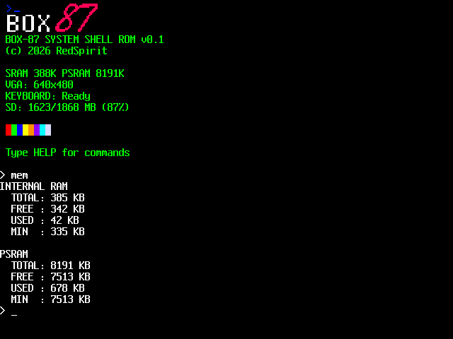

# BOX-87

**BOX-87** — это прошивка для **ESP32-S3**, реализующая консольную операционную систему `box87` (в духе DOS) и одновременно являющаяся основой для ретро-игрового движка.

Проект нацелен на создание самостоятельной 8/16-битной среды разработки, в которой можно прямо внутри системы:
- писать код
- создавать графику
- сочинять музыку
- собирать уровни
- разрабатывать игры

Игровой движок находится в активной разработке.

---

## Текущие возможности

### Операционная система
- Работа с файлами на **SD-карте**
- Поддержка **PS/2 клавиатуры**
- Консольный интерфейс
- Графический вывод: **640×480 @ 256 цветов**
- Вывод звука

### Мультимедиа
- Просмотр изображений:
  - PNG
  - BMP
  - JPEG
- Воспроизведение видео в собственном формате **.rv**

---

## Аппаратная платформа

- MCU: **ESP32-S3**
- Видео: 640×480, 8-bit цвет
- Хранение данных: SD-карта
- Ввод: PS/2 клавиатура
- Аудио: программная генерация

---

## Статус проекта

🚧 Проект находится в активной стадии разработки.

Фокус текущего этапа:
- развитие ядра системы
- стабилизация файловой подсистемы
- расширение мультимедиа-возможностей
- разработка встроенного игрового движка

---

## Цель

Создать автономную ретро-консоль нового поколения на современном микроконтроллере, объединяющую:

- минималистичную ОС
- инструменты разработки
- игровой движок
- мультимедийные возможности

---

## Credits

- VGA driver - https://github.com/bitluni/ESP32-S3-VGA
- PNG reader - https://github.com/lvandeve/lodepng